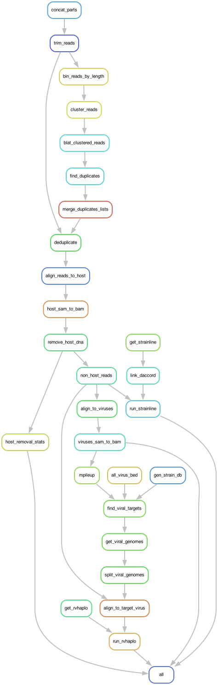

# README

## Cleaning the data

- [x] Add read trimming using [NanoFilt](https://github.com/wdecoster/nanofilt)
  - Before deduplication
  - Trimming will just be a static length (length of nanopore adaptor + 5 (UMI) + length of illumina adaptors) on both the head and tail of the sequence
- [x] Add read deduplication
- [ ] Create custom adapter file for interrogating the trimmed sequences

## Generate improved stats

- [x] Need to output the total number of reads BEFORE & AFTER deduplication
- [x] Output read lengths before and after deduplication
  - Could output this data and then use an `r script` to generate a histogram
- [ ] Write r-script(s) for looking at read qc data

## Improving target strain selection

- [ ] Update `find_viral_targets.py` to select best strain for each virus with genome fraction >= 80% (using average depth to break ties)
  - Make special case for influenza as the virus has multiple segments for each strain
  - Also make it so the script output stats for genome fraction and average depth

## Extra

- [x] **Reach out to HiPerGator about symlink with daccord and Strainline**
- [x] Create DAG flowchart and include in README
  - `snakemake --forceall --rulegraph | dot -Tpdf > dag.pdf`

**Putting haplotype generation on hold FOR NOW**

- [ ] Add check for number of reads aligned to single strain and if (for some reason) the read count falls below a selected threshold (look at RVHaplo docs to confirm) don't run RVHaplo for this strain X barcode

## Workflow Image

