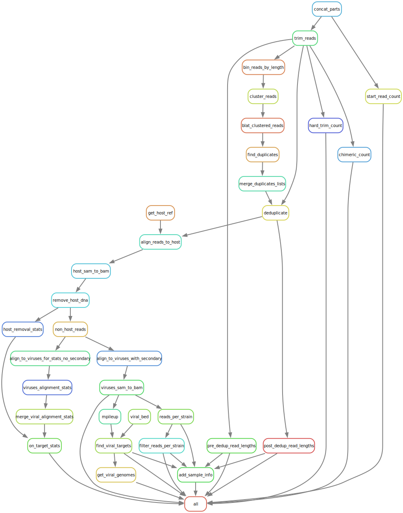

# TELSVirus


A workflow for viral strain detection *(will update)*.

## Requirements

All dependancies are managed through
[`conda`](https://docs.conda.io/projects/conda/en/latest/user-guide/install/index.html)
environments included in the repository.

The workflow is currently built around basecalled Nanopore sequencing output.
This does not mean it cannot work for PacBio sequencing data, but it has not
been tested on this.

### Install Snakemake and Clone the Repository

**Create the environment for `telsvirus` using conda:**

```bash
conda create -c conda-forge -c bioconda -n telsvirus snakemake git
```

**Clone the repository:**

```bash
conda activate telsvirus
git clone https://github.com/jonathan-bravo/TELSVirus.git
```

### Update Config

Default values in the `config/config.yaml` should be updated for new runs, and
samples. 

| Config Variable | Default Value | Purpose |
| - | - | - |
| `email` | "" | NCBI requests |
| `run_id` | "test" | output run folder |
| `host_organism` | "Sus Scrofa" | downloading host ref form NCBI |
| `host_genome` | "" | reference for host removal |
| `viral_genomes` |  "resources/test/allvirusgenomes_poly-a_removed_hand_edit.fasta" | reference for viral alignments |
| `strain_db` | "resources/test/strain_db.tsv" | viral strain source info |
| `barcodes` | "resources/test/RapidBarcode.fasta" | trimming and chimera splitting |
| `reads` | "resources/test/reads" | input sample folders containing fastqs |

If no location for a host genome is provided, TELSVirus will use the
`host_organism` value to download one from NCBI. TELSVirus also
makes requests to NCBI for serotype, strain, and segment information so an email
must be specified. The input data specified at `reads` should be a directory
that containes many sample directories - each containing one to many FASTQ
files. An example of this can be seen here: `resources/test/reads/`.

> *NOTE: All files can exist outside of the TELSVirus directory as long as paths
> are correct. Alternatively files can be symbolically linked or copied to the
> desired location.*

It is important that the `viral_genomes` fasta file be structured as follows:

```
>HV235472.1 |JP 2009213495-A/7: Recombinant Porcine Adenovirus Vector
CATCATCAATAATATACCGCACACTTTTATTGCCCCTTTTGTGGCGTGGTGATTGGCGGA
GAGGGTTGGGGGCGGCGGGCGGTGATTGGTGGAGAGGGGTGTGACGTAGCGTGGGAACGT
...
>FW304282.1 |METHODS AND COMPOSITIONS FOR INCREASING TISSUE TROPISM OF RECOMBINANT ADENOVIRAL VECTORS
TATAAACCAGTTCCACCATGGGACCGAAGAAGCAGAAGCGCGAGCTCCCCGAGGACTTCG
ATCCAGTCTACCCCTATGACGCCCCGCAGCTGCAGATCAATCCACCCTTCGTCAGCGGGG
...
>BD080521.1 |Recombinant porcine adenovirus vector
CATCATCAATAATATACCGCACACTTTTATTGCCCCTTTTGTGGCGTGGTGATTGGCGGA
GAGGGTTGGGGGCGGCGGGCGGTGATTGGTGGAGAGGGGTGTGACGTAGCGTGGGAACGT
...
```

The TELSVirus workflow uses the accession numbers at the beginning of the FASTA
read id for NCBI queries. If no location for a strain db is provided, TELSVirus
will use the accessions to generate one for you.

### Usage on Local Desktop or Interactive HPC Run

Make sure to update the `core` value `local` or `hpc` profiles located at
`workflows/profiles/local/config.yaml` or `workflows/profiles/hpc/config.yaml`
if a different number of CPU cores is available on your system.

| Profile | Profile Variable | Default Value |
| - | - | - |
| `local` | `cores` | 6 |
| `hpc` | `cores` | 120 |

**Running the workflow locally:**

```bash
cd TELSVirus

snakemake --profile worflow/profiles/local
```

**Running the workflow on an HPC interactively:**

```bash
cd TELSVirus

snakemake --profile worflow/profiles/hpc
```

### Usage on Slurm Cluster

Make sure to update the `email`, `account`, and `qos` values in the slurm
profile located at `worflow/profiles/slurm/config.yaml`

```yaml
default-resources:
  - mem_mb=32000
  - account=
  - qos=
  - email=
  - mail_type="NONE"
```

Make sure all string values are surrounded by double quotes **("")**.

**Move the `run.sh` from the `resources` directory up one level:**

```bash
mv resources/run.sh .
```

Make sure to edit the `email` and `time` if necessery for your run. *(I believe
the email is necessary for batch runs.)*

```sh
#SBATCH --mail-user=<email>
#SBATCH --time=24:00:00
```

**Launching a SLURM job for the workflow:**

```bash
cd TELSVirus

# Run the workflow
sbatch run.sh
```

### Output

*Update with output*

| Name | Content |
| - | - |
| file | data |

### Making a Workflow DAG

```bash
snakemake --forceall --rulegraph | dot -Tsvg > dag.svg
```

## Workflow DAG Image

